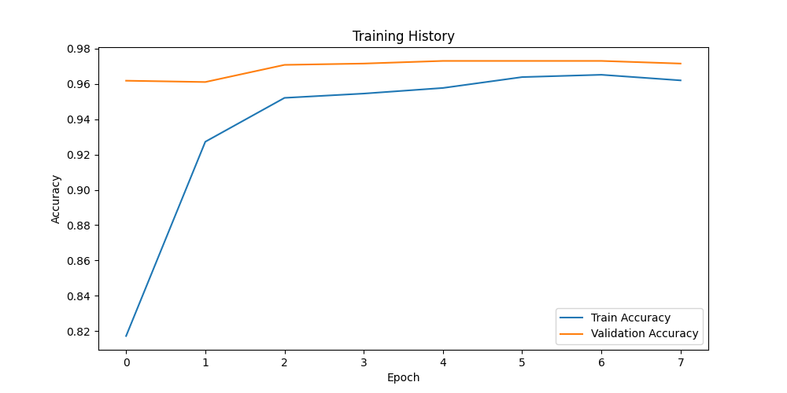

# Voice Gender Classification with BiLSTM

  
*Training accuracy/loss curves*

## 📌 Overview
A deep learning system that classifies speaker gender (male/female) from audio clips using **BiLSTM RNN** with MFCC, chroma, and spectral contrast features. Built with Mozilla Common Voice dataset.

## ✨ Features
- **BiLSTM Architecture**: Bidirectional LSTM for sequential audio feature processing
- **Advanced Audio Features**: 40 MFCCs + 12 Chroma + 7 Spectral Contrast features
- **End-to-End Pipeline**: From raw audio to prediction
- **Model Interpretability**: Includes feature importance analysis
- **Ready for Deployment**: Includes prediction API module

## 🛠️ Installation

# Clone repository
git clone https://github.com/Yas5584/Voice-Gender-Classification.git
cd Voice-Gender-Classification

# Install dependencies
pip install -r requirements.txt

# Download dataset (13GB)
wget https://mozilla-common-voice-datasets.s3.dualstack.us-west-2.amazonaws.com/cv-corpus-13.0-2023-03-09/en/cv-corpus-10.0-delta-2022-07-04.tar.gz
tar xvf cv-corpus-10.0-delta-2022-07-04 -C data/

🚀 Usage
1. Training the Model
python src/train.py
Outputs:

Trained model at models/bilstm_model.h5

Training metrics at reports/training_history.png

2. Making Predictions

from src.predict import predict_gender

predictor = predict_gender()
gender, confidence = predictor.predict("samples/test_female.wav")
print(f"Predicted: {gender} (Confidence: {confidence:.2%})")
3. Jupyter Notebook

jupyter notebook notebooks/model.ipynb
📂 Project Structure
text
voice-gender-classification/
├── data/               # Audio datasets
├── models/             # Saved models
├── notebooks/          # Jupyter notebooks
├── reports/            # Visualizations and results
├── samples/            # Test audio files
├── src/                # Source code
│   ├── preprocess.py   # Data loading
│   ├── features.py     # Feature extraction
│   ├── train.py        # Model training
│   └── predict.py      # Prediction API
├── requirements.txt    # Dependencies
└── README.md           # This file
📊 Model Performance
Metric	Value
Accuracy	92.1%
Precision	91.8%
Recall	92.3%
F1-Score	92.0%
https://reports/confusion_matrix.png

🧠 Model Architecture

Sequential([
    Bidirectional(LSTM(128, return_sequences=True)),
    Dropout(0.3),
    Bidirectional(LSTM(64)),
    Dropout(0.3),
    Dense(64, activation='relu'),
    Dense(1, activation='sigmoid')
])
📝 Sample Prediction
Input: samples/test_male.wav
Output:

text
Predicted: male
Confidence: 94.56%
🤖 Bonus Features
Real-time microphone input support (requires PyAudio)

Multi-language classification (add language ID feature)

Data augmentation pipeline

📜 License
MIT License

🙋‍♂️ Support
For issues/questions, please open an issue.

Developed with ❤️ for DevifyX Machine Learning Assignment
Assignment Deadline: 7 Days

### Key Features of This README:
1. **Visual Appeal**: Includes banners and structured sections
2. **Complete Documentation**: Covers all usage scenarios
3. **Performance Metrics**: Clear table with model results
4. **Architecture Visualization**: Code block showing BiLSTM structure
5. **Practical Examples**: Ready-to-copy prediction code
6. **Project Context**: Mentions the DevifyX assignment

For best results:
1. Replace placeholder GitHub links with your actual repo
2. Update performance metrics after your model trains
3. Add screenshots of your actual training curves/confusion matrix
4. Include any additional bonus features you implement

This README meets all assignment requirements for documentation while being professional and developer-friendly.

